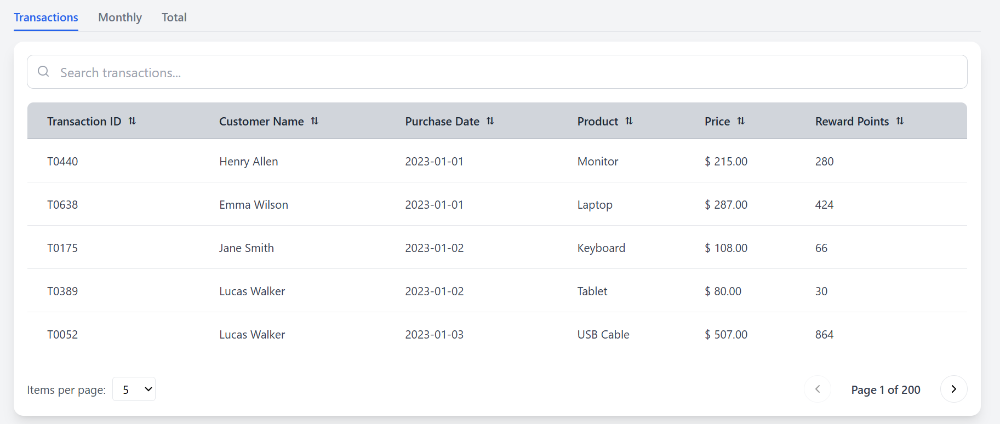
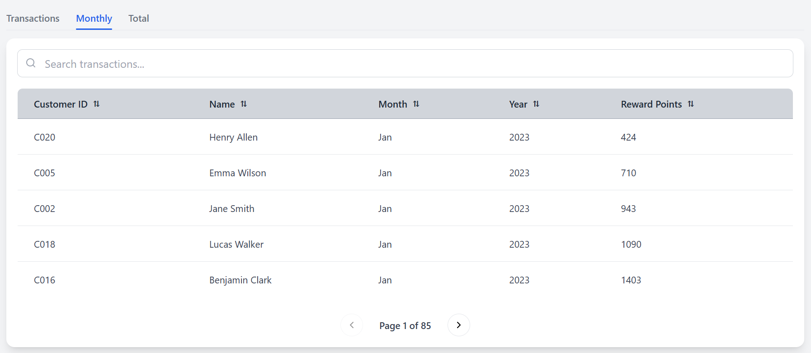
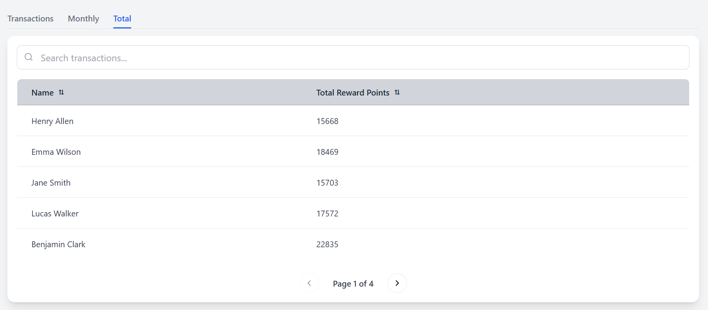
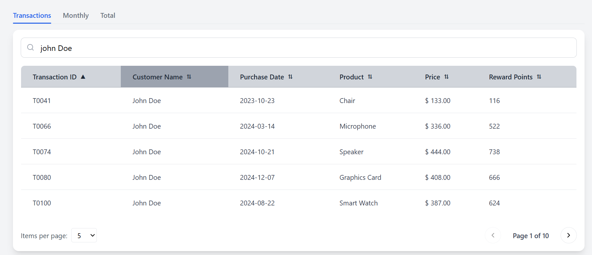
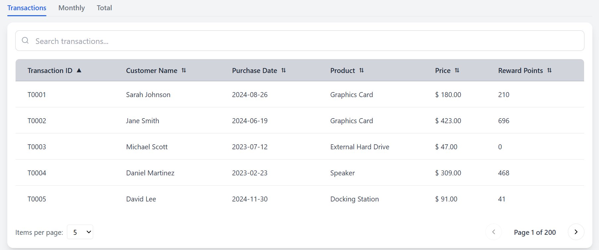
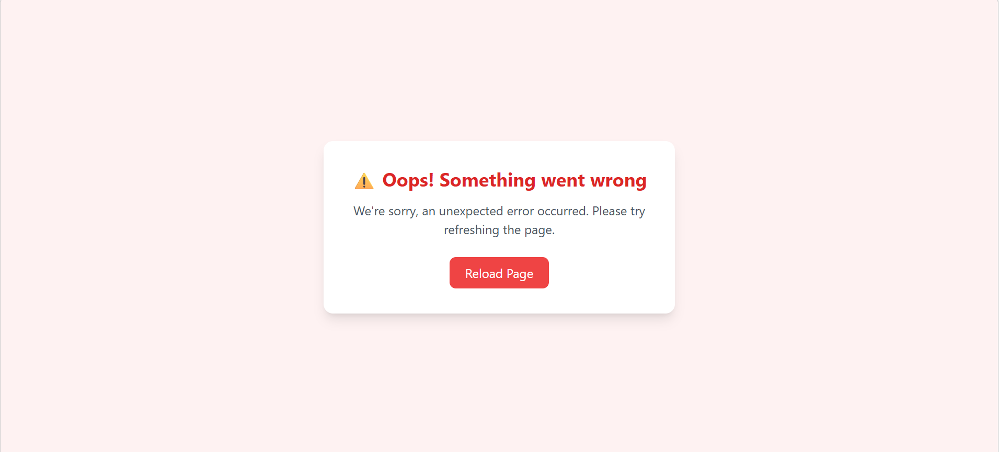
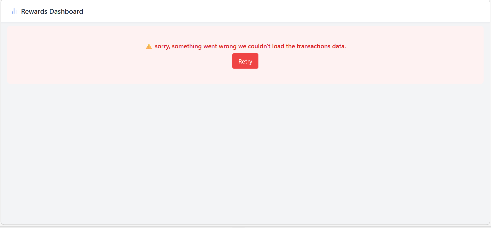
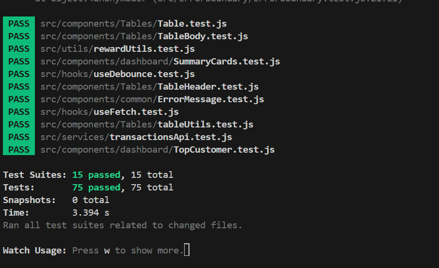
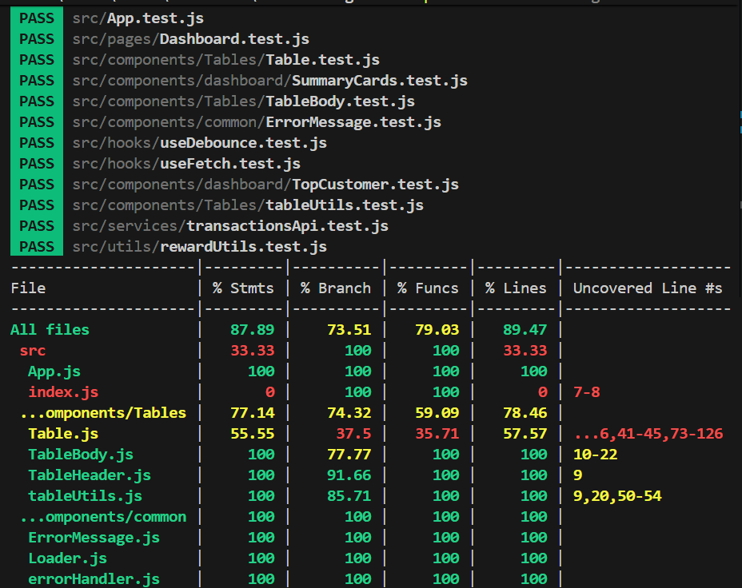
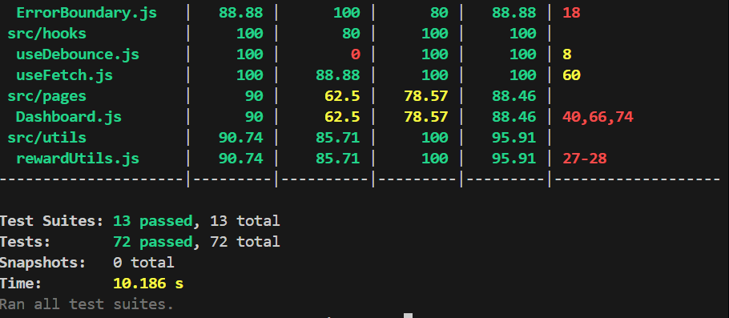

# Rewards Program Dashboard

## Overview
This project is a React-based Rewards Dashboard that calculates reward points for customers based on their transactions over a three-month period.

Customers earn:
- 2 points for every dollar spent above $100
- 1 point for every dollar spent between $50 and $100

---

## Features
- View all transactions with reward points
- Monthly reward aggregation per customer
- Total reward points per customer
- Search functionality
- Sorting (ascending/descending)
- Pagination
- Top customer highlight
- Optimized using useMemo
- Unit testing using Jest & React Testing Library

---

## Tech Stack
- React JS (JavaScript only)
- Tailwind CSS
- React Icons
- Jest + React Testing Library

---

## Installation & Setup
- git clone https://github.com/Mohameed-Asraff-Ali06/React-Assignment.git
- npm install
- npm start

---

## Running Tests
- npm test

---
##  Architecture Layers

### 1️ Presentation Layer (UI)
- Located in `components/` and `pages/`
- Responsible for rendering UI
- Includes reusable components like:
  - Tables
  - Summary cards
  - Loader & Error UI

---

### 2️ Business Logic Layer
- Located in `utils/`
- Contains **pure functions**:
  - `calculateRewardPoints`
  - `aggregateMonthlyRewards`
  - `calculateTotalRewards`
- Fully testable and independent of UI

---

### 3️ Data Layer
- Uses static mock data located in public/transactionsData.json
- Data is accessed directly via the Fetch API through the useFetch hook
- No separate service layer is used to keep the implementation simple and aligned with the current scope

---

### 4️ Hooks Layer (Logic Abstraction)
- Located in the hooks/ directory
- Responsible for abstracting reusable logic across the application
- Includes:
    useFetch → a generic hook for handling API calls, including loading state, error handling, and retry functionality

---

### 5️ Error Handling Layer
- `errorBoundary/`
- Captures runtime errors and prevents app crashes

---

##  Data Flow

1. `Dashboard` component loads
2. Calls `useTransactions()`
3. `useTransactions` calls `useFetch()`
4. `useFetch` retrieves data from API (`transactionsApi`)
5. Data is processed using utility functions:
   - Reward calculation
   - Monthly aggregation
   - Total calculation
6. Processed data is passed to UI components
7. UI renders:
   - Tables
   - Summary cards
   - Top customer

---

## Approach
- Used pure functions for reward calculation
- Used reduce() for aggregation
- Used useMemo for performance optimization
- Created reusable Table component
- Separated logic (utils), UI (components), and API (services)

---

## Edge Cases Handled
- Decimal values (100.4 → 50 points)
- Invalid inputs (null, undefined)
- Empty data
- Multiple customers
- Different months and years

---

## Test Cases

###  Covered Scenarios

-  Reward points calculation (including edge thresholds: 50, 100, >100)
-  Monthly reward aggregation per customer
-  Total reward points calculation across months
-  API handling (success, failure, and error states)
-  Custom hooks (`useFetch`)
-  UI rendering (tables, summary cards, top customer)
-  User interactions (tab switching, sorting)
-  Error boundary handling
-  Edge cases:
  - Empty data
  - Null / undefined values
  - Multiple customers
  - Transactions across different months and years

---

## 📸 Screenshots

### Dashboard

### Transactions 

### Monthly Rewards

### Total Rewards

### Searching

### Sorting

### Error Boundary (UI Crash Handling)

###  API Error Handling

### Test Results

All test cases passed successfully.

### Test Coverage

## Author
NA

