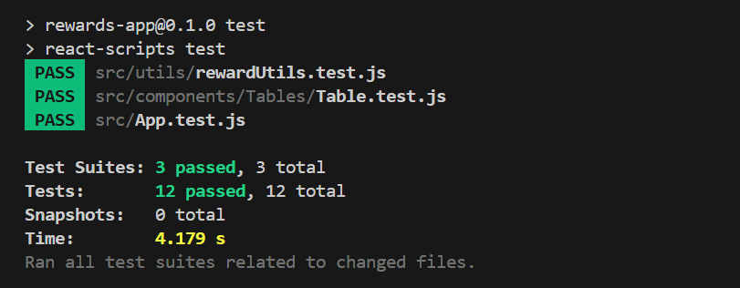
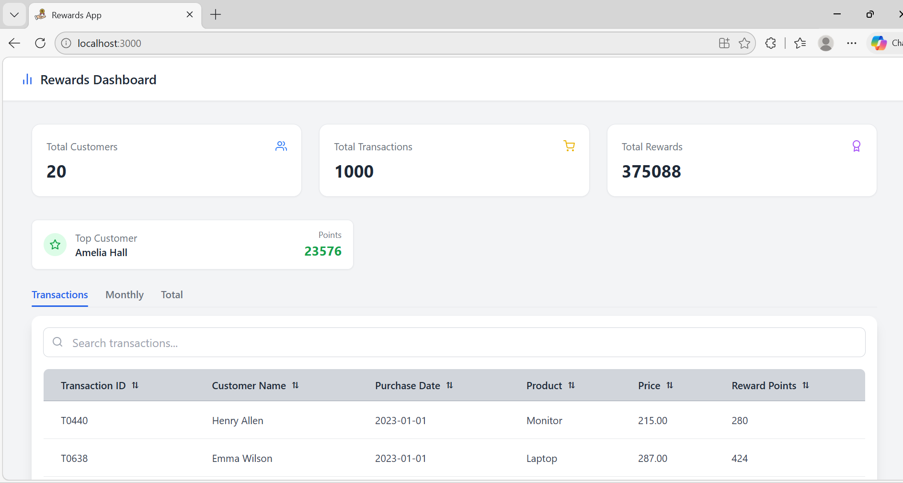
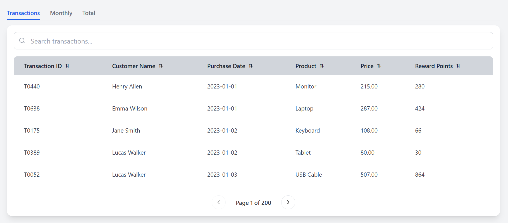

# Rewards Program Dashboard

## Overview
This project is a React-based Rewards Dashboard that calculates reward points for customers based on their transactions over a three-month period.

Customers earn:
- 2 points for every dollar spent above $100
- 1 point for every dollar spent between $50 and $100

---

## Features
- View all transactions with reward points
- Monthly reward aggregation per customer
- Total reward points per customer
- Search functionality
- Sorting (ascending/descending)
- Pagination
- Top customer highlight
- Optimized using useMemo
- Unit testing using Jest & React Testing Library

---

## Tech Stack
- React JS (JavaScript only)
- Tailwind CSS
- React Icons
- Jest + React Testing Library

---

## Installation & Setup
git clone https://github.com/Mohameed-Asraff-Ali06/React-Assignment.git
cd rewards-app
npm install
npm start

---

## Running Tests
npm test

---

## Approach
- Used pure functions for reward calculation
- Used reduce() for aggregation
- Used useMemo for performance optimization
- Created reusable Table component
- Separated logic (utils), UI (components), and API (services)

---

## Edge Cases Handled
- Decimal values (100.4 → 50 points)
- Invalid inputs (null, undefined)
- Empty data
- Multiple customers
- Different months and years

---

## Test Cases

### Covered Scenarios

- ✔ Reward points calculation
- ✔ Monthly aggregation logic
- ✔ Total reward calculation
- ✔ Edge cases (empty data, multiple transactions)

---

## ✅ Test Results

All test cases passed successfully.

---

## 📸 Screenshots

### Dashboard

### Transactions 

### Monthly Rewards

### Total Rewards

---

## Author
NA

